# 📱💰 SmartSpend — Your Personal Finance Buddy

**SmartSpend** is a personal expense tracker and budgeting app built with **Flutter** and **Firebase**. Log expenses in seconds, set overall or category budgets that track themselves, and see where your money goes — on **Android** and in the **browser**, in light or dark mode.

<div align="center">
  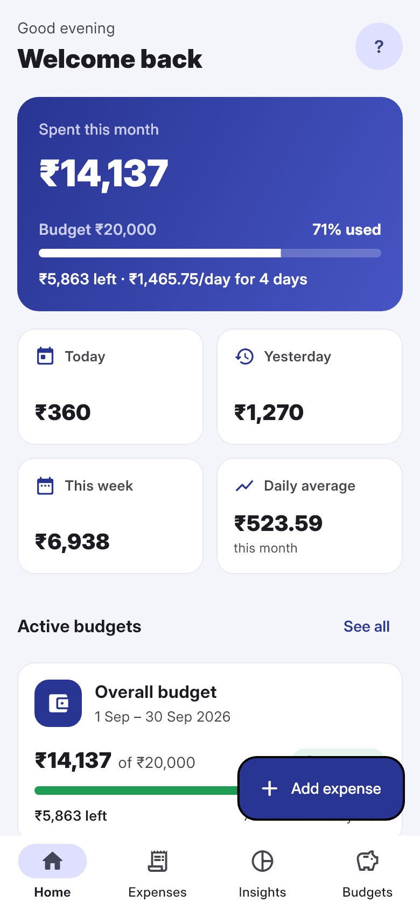
  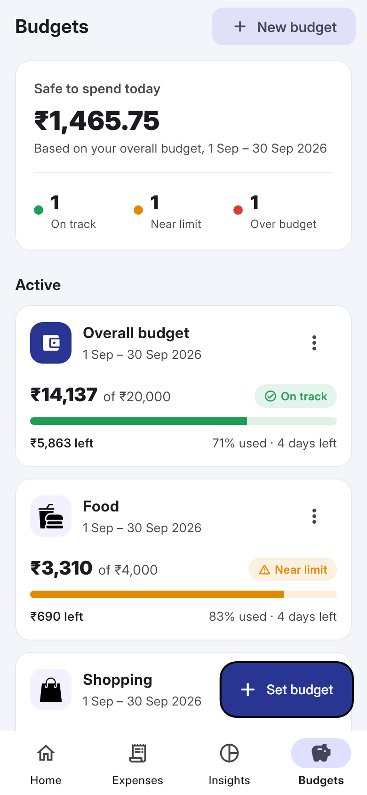
  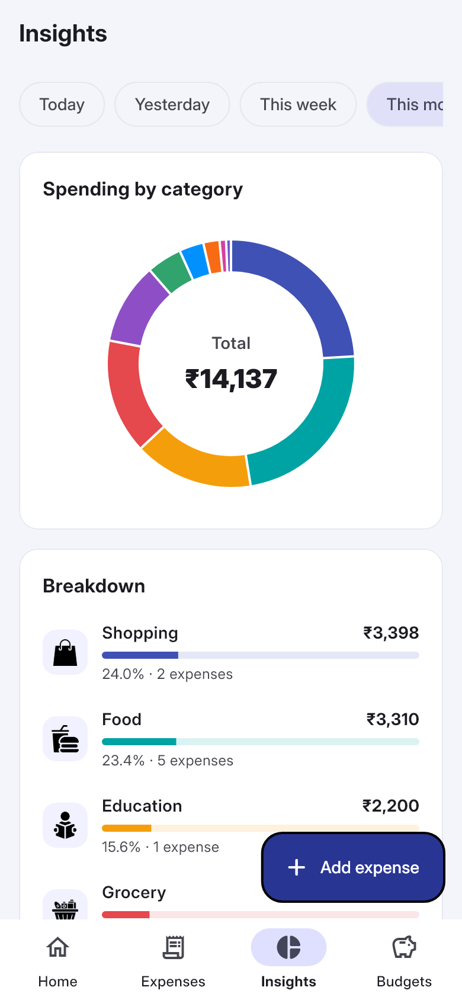
</div>

---

## 🌟 Features

### 🏠 Home
- Total spent this month, with progress against your overall budget
- How much is left and how much you can spend per day for the rest of the period
- Today, yesterday, this week and daily-average totals
- Your active budgets and most recent expenses at a glance

### 💸 Expenses
- Add an expense with an amount, one of 29 categories, a date and an optional note
- Edit or delete any expense by tapping it
- Filter by **Today, Yesterday, This week, This month, This year, All time** or a **custom date range**
- Search by category or note
- Expenses grouped by day, with daily totals, transaction count and average per day

### 🎯 Budgets
- **Overall budgets** (all spending) and **category budgets** (e.g. Food, Shopping), side by side
- Quick periods — *This month*, *Next month*, *This week* — or any custom dates
- Live tracking: spent vs. limit, remaining amount, days left, and a status of **On track**, **Near limit** or **Over budget**
- Budget details: daily limit, average spend per day, safe amount to spend per day, projected total, category breakdown and every expense counted in the budget
- Alerts when an expense takes a budget past 75% or over its limit
- Active, upcoming and past budgets; overlapping budgets of the same kind are prevented

### 📊 Insights
- Donut chart and ranked breakdown of spending by category
- Spending trend bar chart (daily, or monthly for longer periods)
- Works with the same period filters as Expenses

### 👤 Account & settings
- Google Sign-In (Firebase Authentication)
- Profile with gender, mobile number, address and pincode
- Light, dark or system theme (remembered between sessions)
- Help & contact form, FAQs, Terms & Conditions, About
- Reset all data, and log out

### 🖥️ Responsive design
- **Phones:** bottom navigation bar and a floating "Add" button
- **Tablets & desktop browsers:** side navigation rail and multi-column layouts

---

## ⚙️ Tech Stack

| Area | Technology |
| --- | --- |
| UI | Flutter (Material 3), Inter font |
| State management | Provider |
| Authentication | Firebase Authentication + Google Sign-In |
| Database | Cloud Firestore (real-time listeners) |
| Charts | fl_chart |
| Local preferences | shared_preferences (theme) |
| Formatting | intl (Indian ₹ grouping, e.g. ₹1,23,456) |

---

## 🚀 Getting Started

### 📋 Prerequisites
- Flutter SDK 3.x (Dart ^3.7.2)
- A Firebase project
- Google Chrome (to run on the web) and/or Android Studio with an Android SDK (to run on Android)

### 📥 Installation

1️⃣ Clone the repository:
```bash
git clone https://github.com/milankothiya008/SplitLedger.git
cd SplitLedger
```

2️⃣ Install dependencies:
```bash
flutter pub get
```

3️⃣ Configure Firebase:
- In the [Firebase console](https://console.firebase.google.com/), create a project and enable **Authentication → Sign-in method → Google** and **Cloud Firestore**.
- **Android:** add an Android app and place `google-services.json` in `android/app/`.
- **Web:** add a Web app (`</>`), then put its config into `webTestOptions` in `lib/main.dart`. Make sure `localhost` is listed under **Authentication → Settings → Authorized domains**.

> ℹ️ The web config currently in `lib/main.dart` reuses the Android app's values for local testing. Replace it with a registered Web app config before deploying.

4️⃣ Run the app:
```bash
# Android device or emulator
flutter run

# Chrome
flutter run -d chrome

# Any browser, at a fixed address (http://localhost:8080)
flutter run -d web-server --web-hostname localhost --web-port 8080
```

### 🧪 Tests
```bash
flutter test
```
Unit tests cover budget date ranges, status and days left, overlap detection, period calculations (week, month, yesterday) and currency formatting.

---

## 🗂️ Project Structure

```
lib/
├── main.dart                 # Firebase init, providers, theme
├── data/
│   ├── app_data.dart         # Live Firestore data + all reads/writes (Provider)
│   └── categories.dart       # The 29 expense categories and chart colours
├── models/
│   ├── expense.dart
│   └── budget.dart           # Date range, status, overlap logic
├── screens/
│   ├── Wrapper.dart          # Shows Login or the app based on auth state
│   ├── Login.dart
│   ├── HomeShell.dart        # Bottom bar (phone) / side rail (wide screens)
│   ├── Dashboard.dart        # Home tab
│   ├── RecordPage.dart       # Expenses tab
│   ├── ChartPage.dart        # Insights tab
│   ├── BudgetsPage.dart      # Budgets tab
│   ├── BudgetDetail.dart
│   ├── SetBudget.dart        # Create / edit budget
│   ├── AddExpense.dart       # Add / edit / delete expense
│   ├── ProfilePage.dart, Settings.dart
│   └── Help.dart, FAQs.dart, AboutUs.dart, TermsCondition.dart
├── theme/app_theme.dart      # Light & dark themes, theme controller
├── utils/                    # Currency/date formatting, period ranges
└── widgets/                  # Shared cards, pickers, lists, budget cards
```

### 🔥 Firestore collections

| Collection | Fields |
| --- | --- |
| `Users` | `Name`, `Email`, `Gender`, `Mobile`, `Address`, `Pincode` (document id = user uid) |
| `Expenses` | `Id` (user uid), `Category`, `Amount`, `Message`, `Date` |
| `Budget` | `Id`, `Amount`, `StartDate`, `EndDate` — overall budgets |
| `CategoryBudget` | `Id`, `Category`, `Amount`, `StartDate`, `EndDate` — category budgets |

Budget dates are inclusive: a budget from 1 Sep to 30 Sep counts every expense up to 30 Sep, 11:59 PM.

---

## 📸 Screenshots

### 🏠 Home
Monthly spending, budget progress, quick stats and recent expenses.

<div align="center">
  
  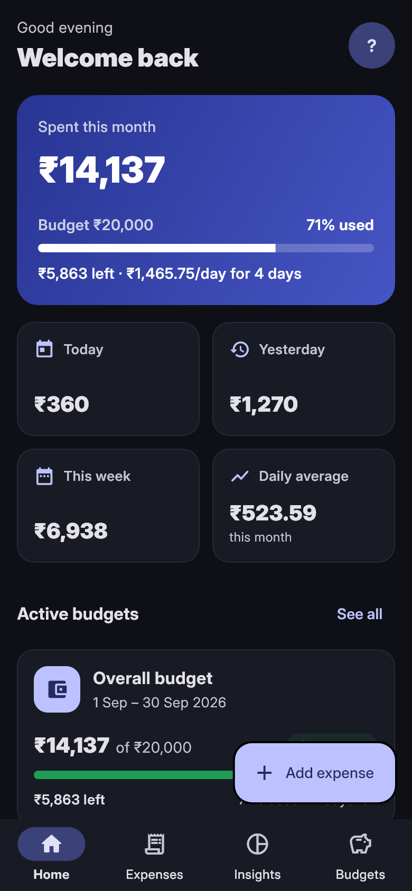
</div>

---

### 🎯 Budgets
Set overall or category budgets and track them live.

<div align="center">
  
  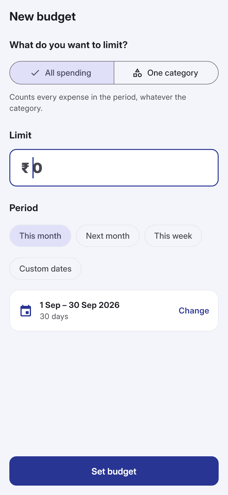
  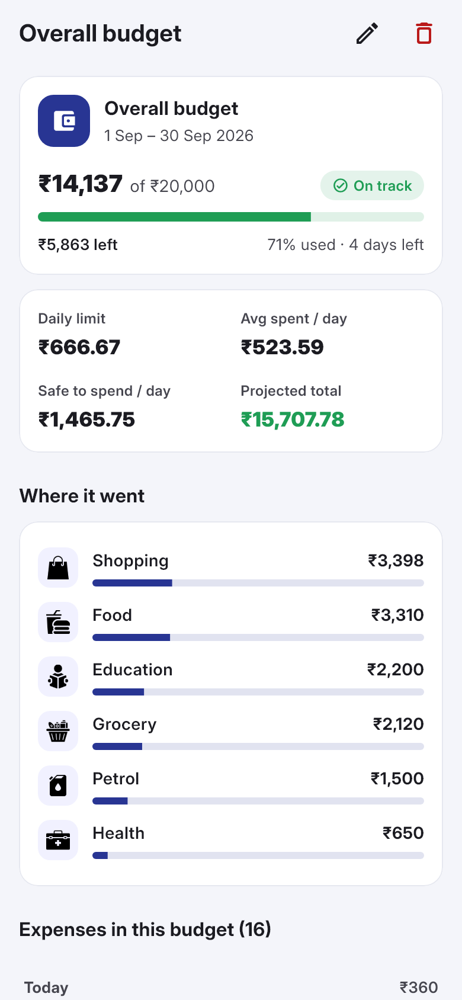
</div>

---

### 💸 Expenses
Filter by period, search, and tap to edit. Add expenses by picking a category.

<div align="center">
  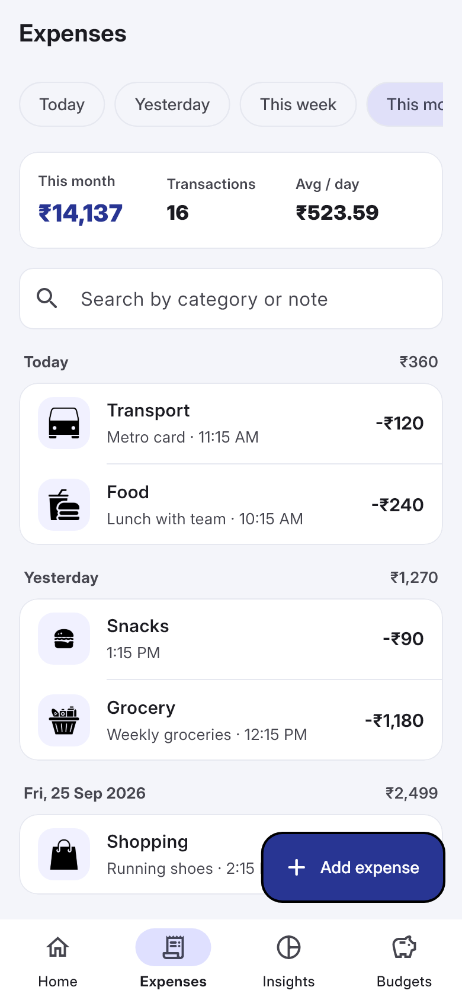
  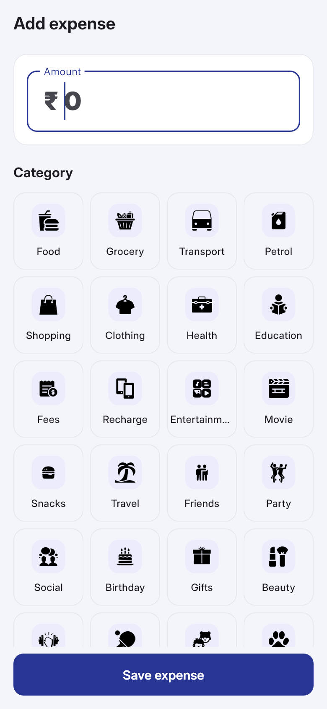
</div>

---

### 📊 Insights
Category breakdown and spending trend.

<div align="center">
  
</div>

---

### 🖥️ In the browser
Wide screens get a side navigation rail and multi-column layouts.

<div align="center">
  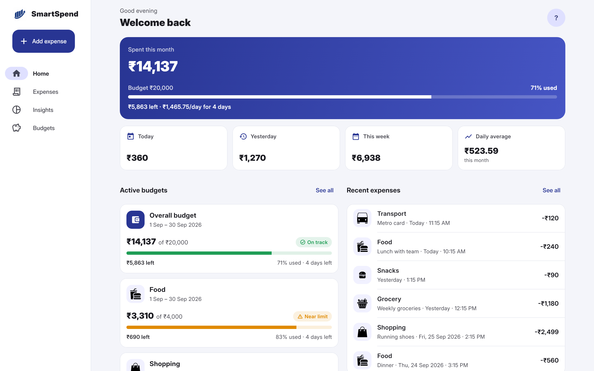
  <br/><br/>
  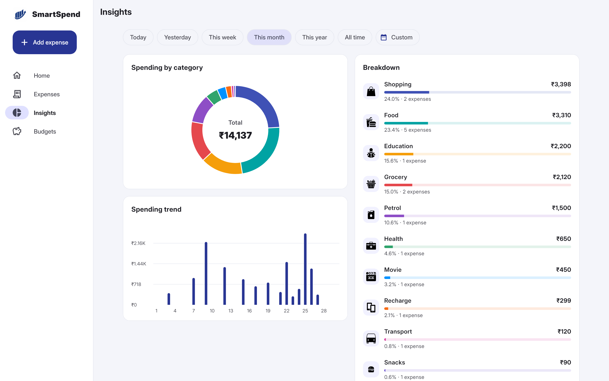
  <br/><br/>
  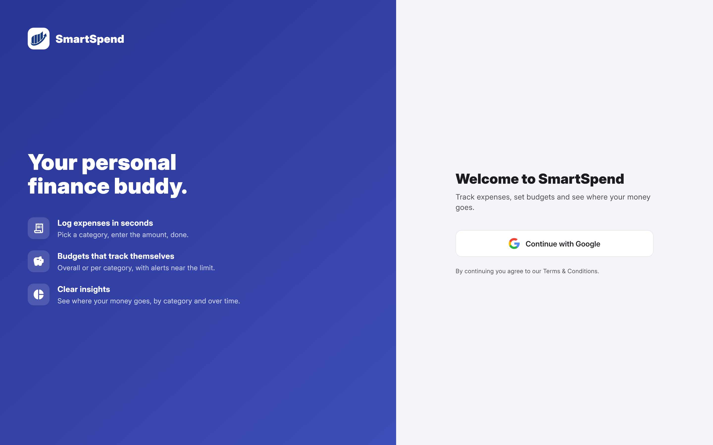
</div>

---

## 🛣️ Roadmap
- Export transactions to PDF / Excel
- Custom categories
- Recurring expenses

---

## 🤝 Contributing

1️⃣ **Fork the repository**

2️⃣ **Create a feature branch**
```bash
git checkout -b feature/AmazingFeature
```
3️⃣ **Commit your changes**
```bash
git commit -m 'Add some AmazingFeature'
```
4️⃣ **Push to the branch**
```bash
git push origin feature/AmazingFeature
```
5️⃣ **Open a Pull Request**

---

## 📞 Contact

- 🧑‍💻 **Milan Kothiya**
- 📧 **Email:** [24ceuog056@ddu.ac.in](mailto:24ceuog056@ddu.ac.in)
- 🐙 **GitHub:** [milankothiya008](https://github.com/milankothiya008)
- 🔗 **Project Link:** [SplitLedger Repository](https://github.com/milankothiya008/SplitLedger)

## 🤝 Collaborators

I had the pleasure of collaborating and discussing ideas, features, and improvements with:

- **Het Faldu** 🎉

## 🙏 Thank You!

Thank you for checking out **SmartSpend 💸**!

Your feedback, ideas, and contributions are always welcome — they help make this app better for everyone! ✨

If you found this project helpful, feel free to give it a ⭐ on [GitHub](https://github.com/milankothiya008/SplitLedger) and share it with others who might find it useful.

**Happy Budgeting! 📊💰**
